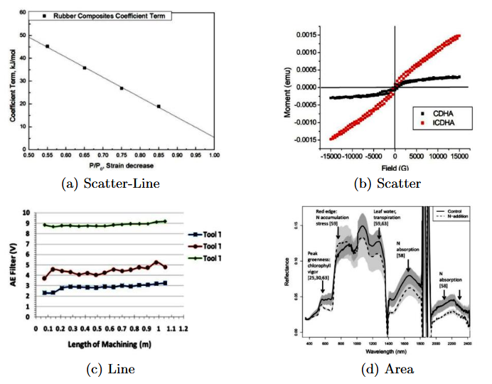
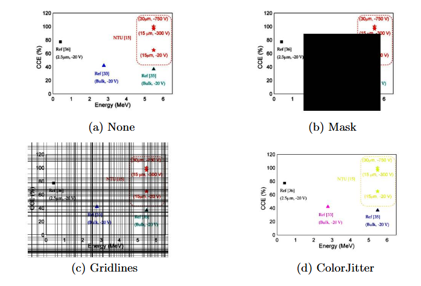
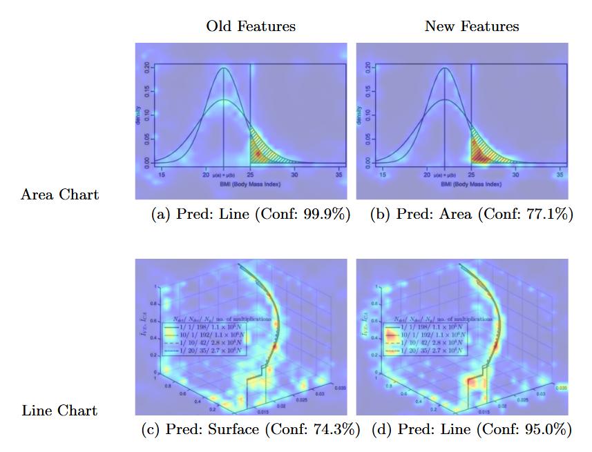

# Optimizing Chart Classification
This repository contains code for reproducing the results of "Optimizing Chart Classification: A Study of Data Augmentation and Training Strategies". You can reproduce our state-of-the-art results (94.90% macro-averaged F1 score on CHART-Info 2024 dataset) using `config/config.json` or edit the file to run your own experiments.

## Motivation
The ability to automatically extract structured data from raw chart images would be very valuable in both industry and academia. Classification is the first step in building an automated pipeline, but there are major challenges that limit model performance on this task. Limited datasets, class similarity, class imbalance, and overall chart heterogeneity lead to relatively poor performance in this domain compared to many other image classification tasks. The image below shows an example of class similarity within our dataset.



## Methods
The CHART-Info 2024 dataset consists of over 50,000 real-world chart images and aims to capture the diversity and challenges of the domain. Using this dataset and existing deep learning architectures (namely ViTs and DINOv2), we studied different data augmentation and training techniques. We reached a new state-of-the-art performance on CHART-Info after implementing strong, domain-specific augmentation strategies to minimize overfitting and a weighted data sub-sampling technique to minimize class imbalance issues. The below augmentations were often applied simultaneously to the training images.    



## Qualitative Analysis
During early experimentation, we would often find that our model "lazily" misclassified images based on features that were common among a class, but not *exclusive* to that class. We designed our training strategy to teach our model better features. Attention map analysis suggests that our methods are successful. For the area chart (top), the "basic" model (a) focuses more heavily on the line feature and misclassifies the image as a line chart with nearly 100% confidence. Our proposed model (b), however, focuses more attention on the area under the curve, which is often a distinguishing feature of area charts. Similarly, our model is able to correctly predict the line chart (bottom) by putting more attention on the correct line, the legend, and the axis labels. In this example, the basic model (c) is presumably making a prediction based on a common class feature that is not truly exclusive to the class (a 3D axis for the surface chart class). 



# Links

- Paper: https://link.springer.com/chapter/10.1007/978-3-032-04627-7_37
- Dataset: https://link.springer.com/chapter/10.1007/978-3-031-78495-8_19
- Model .pth download: https://drive.google.com/drive/folders/1q8Mj0z5A8-Zb2g0XeqQfjjydqFBh4xE_?usp=sharing

# Project Structure

- `python/` - Main source code
  - `main.py` - Entry point for running experiments
  - `occ/` - Core modules
- `config/` - Configuration files
- `output/` - Output directory for logs, CSV results and statistics, error analysis, and plots

# How To

1. Install required Python packages using `requirements.txt`.

2. Use `data_split.json`, along with a copy of the 2024 CHART-Info training dataset, to replicate our custom split of the data. This is an important step, because our split of the data ensures that charts from the same scientific papers do not appear across both the training and validation split, which can lead to overfitting. 

3. Edit and save your config file (`/config`) to set paths and parameters.

4. Run training from the command line. For example:
   ```bash
   python python/main.py config/my_config.json
   ```

5. Find logs, confusion matrices, summary CSV data, and error analysis plots in `output/` (as specified in config file).

---

For more details, see comments in the code and config file, as well as the paper.

# Contact

Feel free to reach out or connect!

- Email: jknize1@depaul.edu
- LinkedIn: https://www.linkedin.com/in/josh-knize-1bb110177/
